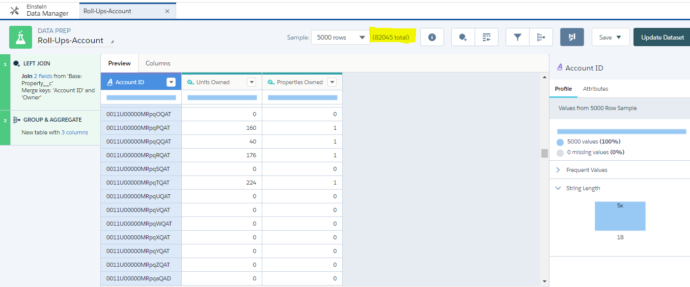

# ThunderRollUps
Salesforce Roll-Up Helper for Einstein

This is an example codebase created to demonstrate how to push aggregate and predictive data from an Einstein Dataset back into salesforce. 

# Example Problem Scope

Let's use a real estate brokerage company as an example.   
The company has two objects: Account and Custom Object Property__c. 
The acccount Object has two fields that the firm would like computations to run nightly that calculate for each client: 
Unit_Count__c  (total units owned)
Property_Count__c (with the total number of properties that that account owns)

One way to proceed would be to build a data-set in Einstein and sync that data back into Salesforce. 

In order to do this the data set would need to have the following structure for output: 

Account ID
Sum(Properties)
Sum(Unit Count)

# Step 1 - Get the Data into Einstein
To import the data objects from salesforce into einstein by connecting them and setting a synchronization schedule. 


# Step 2 - Create an aggregate recipe for the values you want computed
Note: you want to ensure that the total record count is equal to the record count in salesforce to ensure your logic is correct.


After you have created the recipe, you will need to create a dataset schedule for it to produce the data. 
This is much like creating a materialized view, report or the like. You can also choose "run now"


Confirm the dataset is being produced (you can also explore it)


Explore it via the dataset exploration drop down to confirm the data looks correct. 


You can also get the dataset id and version ids from workbench


# Step 3 - Setup the Custom Object to be processed
New SObject (RU_Object_Settings__c) / object name, batch count, start time, status, error text, next time isActive, datasetname/id/version

# Step 4 - Choose the object fields for replication
New Child SObject (RU_Field_Mapper__c) / source api name, target api name, data type

# Step 4 - Schedule an apex job to run on a schedule so it will import the data


# Technical Details  
```java
// Grab the object rollup data set
// get the id's
// build the query based on batch size (offset is available)

String query;
query = 'q = load "0Fb1U0000001FZgSAM/0Fc1U000007O0s4SAC";';
query += 'q = foreach q generate \'Id\' as \'Id\', \'Propert_Units_c_SUM\' as \'Propert_Units_c_SUM\', \'Property_Count__c\' as \'Property_Count__c\';';
query += 'q = limit q 2000;';

ConnectApi.LiteralJson queryresult =  ConnectApi.Wave.executeQuery(query);

String response = queryresult.json;
Map<String,Object> q = (Map<String,Object>) JSON.deserializeUntyped(response); 
response = null; // decrease heap
q = (Map<String,Object>) q.get('results');
List<Object> recordlist =  (List<Object>) q.get('records');
Map<Id, Integer> sumlist = new Map<Id, Integer>(); 

String recId;
Integer sum;

Map<String,Object> rowJSON;
SObject sobj; 
sobj = Schema.getGlobalDescribe().get('Account').newSObject() ;
List<SObject> slist = new List<SObject>();
Integer pcount;
for(Object record : recordlist){

    SObject s2 = sobj.Clone(true,false); // Shallow.. 
    rowJSON = ((Map<String,Object>) JSON.deserializeUntyped(JSON.serialize(record))); //get a map
    recId = (String) rowJSON.get('Id'); // pulll the Id
    
    s2.put('Id', recId);
    // Loop over each field child object ( // Note typeconversion logic would be here
        sum = (Integer) rowJSON.get('Propert_Units_c_SUM'); // Loop on the Fields
        pcount = (Integer) rowJSON.get('Property_Count__c');
        s2.put('Units_Owned__c', sum);
        s2.put('Property_Count__c', pcount);
    slist.add(s2);
}
update slist ; // accts; 
```

Confirm Data is flowing


